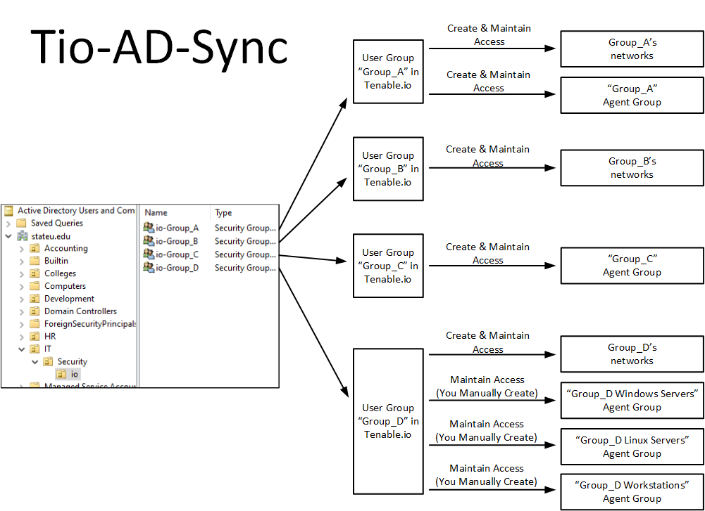
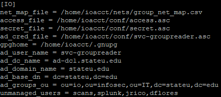

    

&nbsp;

Tio-AD-Sync
===========

## Group Syncing between Active Directory and Tenable.io, and Automated Access Control

Tio-AD-Sync is designed to synchronize certain Active Directory Groups and users with Tenable.io 
groups and users, and automate access to user groups' networks and agent groups in Tenable.io.

## Use case for Tio-AD-Sync
  * Your organization is large enough that a central group delegates access to various groups to 
  run scans and see scan results (for only their own assets).
  * Your organization uses SAML (or easily could use SAML) to authenticate users to Tenable.io.
  * Your organization has, or could easily create, a CSV file mapping various units' names to 
  their networks, in CIDR notation.

## Prerequisites

### Python Libraries
  * pip3 install requests
  * pip3 install pytenable
  * pip3 install navi-pro

### Applications and Scripts
  * Tio-AD-Sync includes and uses GnuPG (GPG) to encrypt your stored Tenable.io API key and 
  secret, as well as the credentials for the minimal-privilege AD account used to read AD group 
  membership.  GPG must be functioning for the user that will be running Tio-AD-Sync.  Some 
  instructions on creating a GPG key for a user can be found here 
  (https://docs.github.com/en/authentication/managing-commit-signature-verification/generating-a-new-gpg-key).  
  You then use GPG to encrypt your Tenable.io access key, your Tenable.io secret key, and the 
  password for your minimally privileged Active Directory user account used to read group 
  membership, and place each in its own file referenced in the Tio-AD-Sync configuration file, 
  as shown later in this document.
  * Navi (https://github.com/packetchaos/navi) must be configured with your Tenable.io access 
  key and secret key for Tio-AD-Sync to work properly.  Navi needs to be run in the same 
  directory as Tio-AD-Sync.

## Usage
         usage: tio-ad-sync.py [-h]
                               [--agent-group-create USERGROUP_WITH_ACCESS_TO_ALL_AGENTGROUPS]
                               [--config-file CONFIG_FILE]

## What Tio-AD-Sync Does When Run
  1.	Get lists of current users and user groups in Tenable.io
  2.	Read Active Directory groups in the designated OU.  These groups must have "io-" preceding 
  the group name that you want to have in Tenable.io.
  3.	Read in your network mappings file, a CSV which maps each group in your organization to 
  the networks (in CIDR block format) to which it should have access.
  4.	Disable any users in Tenable.io who were found in the set of managed Tenable.io groups, 
  but not in the Active Directory groups.  This is done because it indicates they previously 
  were given access membership in an AD group, but then removed.  Note that accounts which you 
  have set as ‘unmanaged’ in your configuration are NOT subject to being disabled in this scenario.
  5.	Check which groups (as well as users contained) do not exist in Tenable, and create them 
  with proper membership.  If there is a new user group being created in Tenable.io, a like-named 
  agent group will also be created if you have selected this option.
  6.	Create tags, under the category of “Networks”, named for each group, which contain the 
  CIDR-notation networks for each group, and grant access (for both viewing and scanning) to the 
  corresponding group.
  7.	Run NAVI and update assets, then update tags of agents within any agent group to grant 
  access to the tag to the appropriate user group.

## Configuration
To use Tio-AD-Sync, you must provide create configuration file with the following:
  * A CSV file mapping each group to its networks
  * The path to your GPG-encrypted Tenable.io API access key
  * The path to your GPG-encrypted Tenable.io API secret key
  * A file with the GPG-encrypted password for your minimally privileged Active Directory service 
  user account
  * Your GPG ‘home’ directory (typically [user homedir]/.gnupg)
  * The name of an active directory service user account with minimal privileges, used to read 
  groups within your Active Directory OU and enumerate their membership
  * The DNS name of one of your Active Directory domain controllers
  * Your Active Directory domain name
  * Your Active Directory base DN
  * An Active Directory OU in which to look for groups to sync with Tenable.io
  * A comma-separated list of ‘unmanaged’ users that you don’t want to have added to managed 
  groups for units in your organization

    

&nbsp;

## Additional Considerations When Using Tio-AD-Sync
  * Most users of Tio-AD-Sync will probably want to use a cron job to ensure regular syncing with 
  Active Directory, as this will ensure both regular upkeep of user group membership and regular 
  refreshing of the tags that ultimately grant access for user groups to access their corresponding 
  agent groups.  Similarly, if you are in an environment where the set of networks belonging to 
  various groups is regularly changing (and presumably this is reflected in a regularly-exported 
  group-to-network mapping file), this is also necessary to keep groups’ access to their networks 
  sufficiently up-to-date.
  * Your groups in Active Directory that you want synced to Tenable.io need to be named with an io- 
  prefix.  In other words, You’d create a group named io-BusinessSchool on the Active Directory side 
  to have a group named BusinessSchool on the Tenable.io side.
  * Tio-AD-Sync will look at your io-named groups in the OU you’ve specified, and add users who are 
  directly members of the groups to the Tenable.io group, as well as direct members of groups 
  directly nested in them.  This is so you can allow various units within your organization who 
  have their own groups to manage their own roll-on and roll-off process.  Simply nest a group of 
  their choosing, and of which they have ownership.
  * If you select the agent group creation option, Tio-AD-Sync will create an agent group with the 
  same name of the user group, which the corresponding unit in your organization may then populate 
  with agents.  Of course, they will have to go through the normal process for that.  Note that 
  many units in your organization will probably want multiple agent groups.  For example, a unit 
  might want an agent group for its Windows servers, another for Linux servers, another for Windows 
  workstations, and another for Mac workstations.  That will work fine, but require a few manual 
  actions on your part to initially set those agent groups up.  The recommended way to do this is 
  still to initially select the agent group creation option.  

  Example: You are using Tio-AD-Sync at a university and the Tenable.io user group and agent group created were BusinessSchool.  The Business school has informed you that they want two agent groups: one for workstations, and one for servers.  Tio-AD-Sync can handle this as long as you name the multiple agent groups beginning with BusinessSchool, followed by a space or short dash character, followed by other text.   Inthis case, to achieve what the Business School is asking for, you could do the following: In Tenable.io, you can rename the BusinessSchool agent group to BusinessSchool Servers, then create a new agent group named BusinessSchool Workstations with the same permissions as the first (this will have been set by the script to have been ‘No Access’ for ‘All Users’, ‘Can Scan’ for ‘Business School’, and ‘Can Scan’ to whatever the name of the central IT group you specified).  Then, in Tenable.io under Settings -> Access Control -> Permissions, edit the rule that was made for Unit Agent Groups:BusinessSchool.  Change it to contain both BusinessSchool Servers and BusinessSchool Workstations under “OBJECTS”.  Now separate agent groups exist for the Business School’s Workstation’s and Servers, which are both accessible to members of the BusinessSchool user group, and the agent groups’ new members will be tagged by Tio-AD-Sync to ensure continued alignment.

## Attribution 
* Tio-AD-Sync uses and includes a version of gnupg.py by Vinay Sajip, released under Public Domain license, for GPG operations.
* Tio-AD-Sync uses Navi, by Casey Reid for agent group tagging.

## Special Thanks
 - Neamen Negash <nnegash at umich.edu> (Contributions re: network syncing)
 - Dale Fay <dalef at umich.edu> (Contributions re: full user names from AD)

## License and Author
Tio-AD-Sync was written by Ross Geerlings <rjgeer@umich.edu>, 
<ross@seekerdlp.com>.

Tio-AD-Sync is licensed under the terms of the GNU GPL v3.0.
